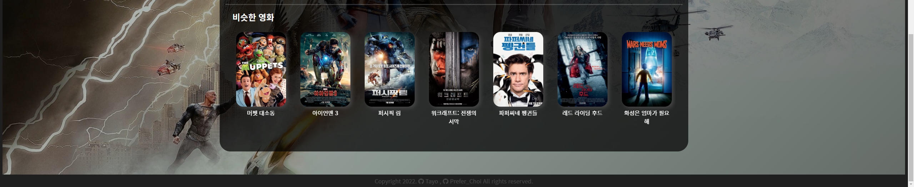
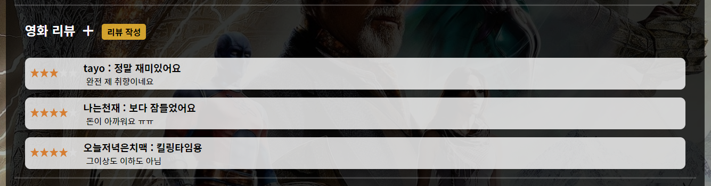
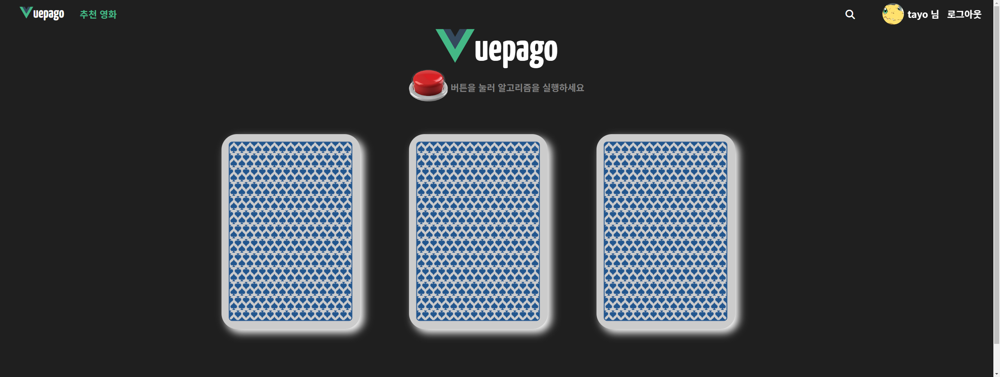
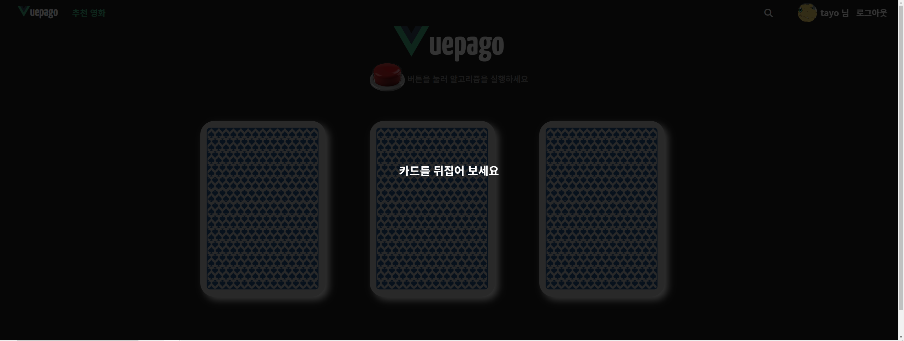

# final-pjt
<p>2022/11/16 ~ 2022/11/24</p>

<details>
<summary>프로그램 실행 시</summary>
프로그램 실행 시 final-pjt-front 폴더 안에
.env.local 파일 생성 후

```bash
VUE_APP_TMDB_API_KEY = { tmdb 키값 입력 }
```
</details>


# 김태영, 최선호 final-pjt 
<p>영화 추천  알고리즘 기반 커뮤니티 서비스</p><br>

<br>

# 1. 팀원 정보 및 업무 분담 내역
### 김태영 : FRONT-END
### 최선호 : BACK-END
<hr>

## *업무 기록

할 일 | 담당 |시작 예정일 | 종료 예정일 | 실제 종료한 날
---|---|---|---|---|
기획 회의| 모두 | 22/11/16 | 22/11/16 | 22/11/16
데이터 모델 작성 | 선호 | 22/11/16 | 22/11/16| 22/11/16
데이터 FIXTURE | 선호 | 22/11/16 | 22/11/16| 22/11/16
ERD 작성 | 선호 | 22/11/16 | 22/11/16 | 22/11/16
FIGMA 작성 | 태영 | 22/11/16 | 22/11/16 | 22/11/16
Dump-data 생성 | 선호 | 22/11/16 | 22/11/16 | 22/11/16
Django model 작성 | 선호 | 22/11/16 | 22/11/16 | 22/11/16
Vue vuex router 구조 | 태영 | 22/11/ | 22/11/16 | 22/11/16
Vue Home | 태영 | 22/11/16 | 22/11/16 | 22/11/17
User | 선호 | 22/11/16 | 22/11/18 | 22/11/18
User Token | 선호 | 22/11/16 | 22/11/18 | 22/11/19
User Like | 선호 | 22/11/18 | 22/11/19 | 22/11/20
User Review | 선호 | 22/11/18 | 22/11/20 | 22/11/20
Vue Detail | 태영 | 22/11/18 | 22/11/20 | 22/11/21
Vue Review | 태영 | 22/11/19 | 22/11/20 | 22/11/21
알고리즘 | 선호 | 22/11/19 | 22/11/23 | 22/11/24
Vue Login | 태영 | 22/11/19 | 22/11/20 | 22/11/20
Vue Signup | 태영 | 22/11/19 | 22/11/20 | 22/11/20 
Vue Search | 태영 | 22/11/19 | 22/11/20 | 22/11/20 
Vue Profile | 태영 | 22/11/21 | 22/11/22 | 22/11/22
회원가입, 로그인, 로그아웃 기능구현 | 모두 | 22/11/20 |22/11/20 | 22/11/20
리뷰기능 구현 | 모두 | 22/11/20 | 22/11/20 | 22/11/21
댓글기능 구현 | 모두 | 22/11/21 | 22/11/21 | 22/11/21
user profile | 모두 | 22/11/21 | 22/11/21 | 22/11/21
profile image 업로드 기능 | 모두 | 22/11/21 | 22/11/22 | 22/11/22
영화 좋아요기능 구현 | 모두 | 22/11/21 | 22/11/21 | 22/11/21
리뷰 좋아요기능 구현 | 모두 | 22/11/21 | 22/11/21 | 22/11/21
팔로우기능 구현 | 모두 | 22/11/21 | 22/11/21 | 22/11/21
영화 평점 구현 | 모두 | 22/11/21 |22/11/21 | 22/11/21
프로필 페이지 사용자 이미지 | 모두 | 22/11/21 | 22/11/22 | 22/11/22
NavBar 사용자 이미지 띄우기 | 태영 | 22/11/22 | 22/11/22 | 22/11/22
프로필 페이지 배경화면 선택 기능 | 태영 | 22/11/22 | 22/11/22 | 22/11/23
알고리즘 | 모두 | 22/11/23 | 22/11/24 | 22/11/24
readme.md 작성 | 태영 | 22/11/24 | 22/11/24 | 22/11/24
ppt 작성 | 선호| 22/11/24 | 22/11/24 | 22/11/24

<br>
<hr>

## 개발 일지
<hr>

<details>
<summary>🖥️ 개발일지 (개발과정)</summary>

# 11/16 개발 일지

첫 난관에 부딪혔다.
ERD 작성을 안해봐서 어떻게 해야 할지 모르겠다.

## FIGMA 작성
<br>

## ERD 작성
<br>


## Vue 구조 잡기
<br>

<hr>

# 11/17 개발 일지

## model 설계
<br>

## serializer 설계
<br>

### 📝 수정 예정 사항
- Detail View 완성 후 필드 값 수정

## view 설계
<br>

## dump 데이터 생성
<br>

## HomeView 
<br>
- swiper 라이브러리를 이용하여 포스터가 슬라이딩 되도록 하였다.

<hr>

# 11/18 개발 일지

## 태영
HomeView 수정
- Youtube API 가 아닌 TMDB에서 src를 가지고와서 Iframe에 넣었음
- 디자인 수정

<br>
<br>

DetailView 작업 시작
- 전체적인 구조를 잡고 틀을 쌓음
- 디테일 안에 리뷰와 리뷰에 대한 댓글 등등 매우 복잡한 요소들이 많으므로 잘 고려해서 구조를 짤 것.
- swiper 라이브러리 때문에 부트스트랩을 쓰지 못해서 grid를 적절히 잘 활용할 것.

## 선호
### User 모델 수정
### img_path, Introduction 추가
  - 둘 다 null=True, if조건문으로 비어있으면 기본 이미지 뜨게 할 건지, 아니면 기본 이미지 경로를 데이터 입력할 때 db에 넣어버릴 건지 결정 요망

### reveiw 모델 수정
datefiled => datetimefiled로 바꿈

### like_movie 만듬
  - 좋아요 누른 영화들 가져오기

### write_review 만들다 망침
  - 리뷰 작성한 영화들 가져오기
  - 리뷰 작성한 것들 가져오는 것 까진 함
  - 반복문으로 하나씩 가져오는 게 맞나 싶음

<hr>

# 11/19 개발 일지

## 태영
### Detail 화면 구성 완료 (기능x)
- 엄청 오래 걸렸다.
- 하다가 계속 갈아엎고의 반복이였다.
- Detail를 여러개의 Component로 잘개 쪼개어서 작업하였다.
- 별점 구현을 위해 star-rating 라이브러리 사용
- 절반은 데이터베이스에서 가져오고 절반은 TMDB API로 정보를 가져왔다.

<br>

리뷰는 Detail창에서 컴포넌트를 띄워서 달 수 있도록 하였다.

<br>

리뷰 댓글도 Detail창에서 컴포넌트를 띄워서 달 수 있도록 하였다.

<br>

아직 화면 구성만 해두었기 때문에 실질적인 기능을 작동하지 않는다.

### NavBar 제작

<br>

-postion: fixed를 사용하여 보여지는 화면 상단에 고정해두었다.
- router link 활성화 시 색 변경 등

### Signup, Login 페이지 제작

<br>
<br>

회원가입과 로그인 페이지 구성만 해두었다 (기능 x)

## 선호
### 기초 머신러닝 모델 응용해서 좋아요 누른 영화들과 일치도 평가하는 모델구상 중

<hr>

# 11/20 개발 일지
## 태영
### 로그인, 로그아웃, 회원 가입 기능 구현
- djangoresframwork-simplejwt를 이용하여 토큰을 발급하였다.
- 회원 가입시 기존에 있는 아이디이거나 비밀번호와 비밀번호확인이 같지 않으면 오류 메세지를 출력하였다.
- 회원 가입 완료시 바로 로그인 함수를 실행하여 자동으로 로그인이 될 수 있도록 하였다.

- 로그인 시에는 사용자 정보가 데이터베이스에 없으면 오류 메세지를 출력하였다.
- 로그인 시 발급되는 토큰과 해당 유저이름은 localStorage에 저장해두고 state에도 저장해두었다.
- 로그인 시 홈화면으로 이동

- 로그아웃을 할 경우 localStorage에 저장된 것들을 삭제하였고 state에 저장된 유저 정보도 삭제하였다.
- 로그아웃 시 홈화면으로 이동시켰는데 홈화면에서 로그아웃 할경우 홈화면으로 다시 이동하여 오류가 발생하여 catch로 오류 처리를 해주었다.

<br>

### NavBar 로그인 유무에 따른 메뉴 변경
- 로그인 시 state에 토큰과 회원 이름이 저장되는데 state에 토큰이 들어있으면 NavBar에 (로그아웃, 유저이름) 을 표시하고 그렇지 않으면 (로그인, 회원가입)을 표시하였다.

<br>
<br>

### 유저 리뷰 CRUD 기능 구현 중

## 선호

# 11/21 개발 일지

### 유저 리뷰 CRUD 기능구현
- 리뷰 조회, 생성, 수정, 삭제 기능 구현
- 본인 리뷰시에만 수정, 삭제 가능

<br>
<br>

- 댓글 조회, 생성, 수정, 삭제 기능 구현
- 본인 댓글만 수정, 삭제 가능

<br>
<br>
<br>
<br>

## 좋아요 기능 구현

- 영화 좋아요<br>
<br>
<br>


- 리뷰 좋아요<br>
<br>
<br>

## 평점 기능 구현
<br>

# 11/22 개발 일지

### 사용자 프로필 구현
<br>
<br>

- 사용자 좋아요 누른 영화 출력
- 사용자 리뷰(별점) 남긴 영화 출력

<br>

<br>
<br>

- ## 사용자 프로필 이미지 추가, 수정 기능 (⭐ 까다로움)
- 이미지를 어떻게 보낼지를 고민을 되게 오래 하였다.
- Vue에서 input=file 태그를 만들고, 입력받은 데이터를 폼으로 묶어서 axios요청을 하였다.
- headesr에 토큰 말고도 'Content-Type' : 'multipart/farm-data' 를 같이 보냈다. 인코딩 디코딩 관련이라고 하는 것 같다?
```js
  // ProfileUpdate.vue
    const form = new FormData()
    form.append("img_path", this.file)
    this.updateProfile({form: form, username: this.profileUsername})

  // Profile.js
    updateProfile(context, {form, username}) {
      const headers = {Authorization : `JWT ${localStorage.getItem('jwt')}`, 'Content-Type': 'multipart/form-data'}
      axios({
        method: 'post',
        url: `http://127.0.0.1:8000/accounts/profile/${username}/`,
        headers: headers,
        data: form,
      })
      .then((response)=>{
        context.commit('GET_MY_PROFILE', response.data)
        context.commit('GET_NAV_PROFILE', response.data)
      })
      .catch((error)=>{
        console.log(error)
      })
    },
```

- 그리고 django에서 저장
- request.FILES 를 쓰지 않았다.
```python
@api_view(['GET', 'POST'])
def profile(request, username):
    User = get_user_model()
    person = User.objects.get(username=username)
    if request.method == 'GET':
        serializer = UserProfileSerializer(person)
        return Response(serializer.data, status=status.HTTP_200_OK)
    
    elif request.method == 'POST':
        serializer = UserProfileSerializer(person, data=request.data)
        if serializer.is_valid(raise_exception=True):
            serializer.save()
        return Response(serializer.data, status=status.HTTP_201_CREATED)
```

<br>
<br>

- 팔로잉 비동기 기능 구현

<br>

- NavBar에 사용자 프로필 이미지 출력

## 추가 오류 수정
- 영화 포스터 없는 영화는 디폴트로 영화 이미지 출력
- NavBar와 Profile의 유저는 다른 것에 대해 출력되는 내용 다르게

# 11/23 개발 일지

## 프로필 배경 화면 사용자 선택

<br>

- 사용자 프로필과 배경 화면을 수정 버튼을 한 곳에서 관리하기위해 dropbox 사용

<br>

- 배경 화면 수정 클릭시 현재 사용자가 좋아요 누른 영화의 배경이미지를 선택할 수 있게 나온다. 배경 선택후 확인 시 뒷 배경이 변한다.

<br>

## 검색 기능 구현

- SearchView로 이동
<br>

- 검색 창에 입력할 때마다 axios 요청으로 db의 데이터를 가지고 옴
<br>
<br>

## 전역 가드 설정
```js
router.beforeEach((to, from, next) => {
  const token = localStorage.getItem('jwt')
  if (!token && (to.name === "DetailView" ||
      to.name === "RecommendationView" ||
      to.name === "SearchView" ||
      to.name === "ProfileView")) {
        alert('로그인이 필요한 서비스 입니다.')
        next({ name: "LogInView"})
      }
  if (from.name === 'SearchView') {
    store.commit('Movies/CLEAR_SEARCH')
    //검색 페이지에서 나왔을 때 스토어 값 초기화
  }
  next()
})
```

- 홈 화면을 제외한 모든 페이지는 로그인한 사용자만 이용가능하게 전역 가드 설정
- 검색 창에서 나왔을 때 store의 state값을 초기화 하기 위한 mutations 호출


## 반응형 웹페이지로 수정 중

<br>
- 웹페이지 크기에 따라 media query를 이용하여 레이아웃의 변화를 줌

## Footer 제작
<br>

## Detail페이지 이미지 크게 보기 기능 추가
<br>

# 11/23 개발 일지

## 로딩 페이지 구현 (with Spinner)
<br>
- 페이지 이동간에 모달과 같은 방식으로 컴포넌트를 띄워서 spinner에 있는 아이콘을 출력하였다.

## 알고리즘
- 자세한 설명은 결과 쪽으로
- 사용자가 좋아요를 누른 영화 데이터를 기반으로 장르, 키워드, 회사, 멀티 장르, 멀티 키워드, 멀티 회사들과의 상관계수를 사용하여 popularity를 기준으로 상위 3개 아이템을 출력해주었다.

- 전달 받은 추천 목록을 카드 형식의 애니메이션으로 뒤집어서 확인 할 수있게 만들었다.
  
<br>
<br>
<br>

- 클릭시 해당 영화 디테일페이지로 이동
</details>

<hr>

# 최종 결과

<hr>

## ERD

<br>

- 모델 관계 구축

## FIGMA

<br>

<br>

<br>

<br>

<br>

<br>

<br>

<br>

<br>

<br>

<hr>

## 컴포넌트 구조

<br>

## 🧑 SignUpView

<br>

<br>

<br>

- 회원가입시에는 유저아이디와 비밀번호, 비밀번호 확인 3가지를 입력받는다.
- 두 비밀번호가 일치하지 않을 경우와 DB에 이미 유저 아이디가 존재하는 경우 오류메세지를 출력하였다.
- 성공적으로 회원가입이 되면 바로 dispatch로 login actions를 호출하여 로그인이 되도록 하였다.

## 👨‍💻 LogInView

<br>

<br>

- 로그인에는 사용자 아이디가 존재하지 않거나 비밀번호가 틀리면 오류메세지를 출력한다.
- 로그인 성공시에는 HomeView로 router를 이용하여 이동하게 된다.

## 🏘️ HomeView


- 메인 화면은 swiper를 이용하여 영화 포스터가 슬라이드 되도록 구현하였다.
- 이번주에 가장 인기있는 top3 영화를 출력하였다.
- 메인 화면 좌측 하단에 관련 동영상을 가져다 놓았다.
- 아래 카테고리는 상영중인 영화, 인기있는 영화, 평점 높은 영화 3가지로 TMDB API로 호출해서 불러오고 있다.
( 마찬가지로 Swiper 이용하여 좌측, 우측으로 부드럽게 슬라이딩이 되도록 하였다.)
- 해당 포스터를 클릭할 경우 해당 영화 상세 페이지로 넘어가게 된다.

## 📖 DetailView




- 디테일 페이지는 배경화면에 영화의 backdrop이미지를 띄워놓고 그 위에 컨텐츠를 만들었다.
- 상단 부분 좌측에는 영화 포스터가 있고 그 하단에 해당 영화의 별점 평균과 좋아요를 누를 수 있는 버튼
그리고 그 밑에는 별점이 표시되는 vue-star-rating 라이브러리가 자리 하고 있다.
- 우측에는 영화에 대한 설명이 있으며 사진을 클릭하면 모달창이 띄워지면서 해당이미지를 크게 볼 수 있게 하였다.

<br>

<br>

- 영화 설명 밑에는 해당 영화에 출연한 출연진들을 swiper를 통해 슬라이드로 구현하였다.

<br>

- 그 밑에는 리뷰를 구현하였다.
- 사용자가 영화에 대한 리뷰를 남길 수 있는 공간이며
- 유저들은 유저끼리 리뷰에 대해 댓글도 남기고 좋아요를 누를 수 있다.

<br>

<br>

<br>

<br>

- 리뷰 생성시 나타나는 입력창은 모달 형태로 제작하였다.
- 자신이 쓴 리뷰, 댓글에 한해서면 수정, 삭제가 가능하다.

<br>

- 디테일 최하단에는 해당 영화에 비슷한 영화의 카테고리를 TMDB로 부터 제공받아 출력하였다.

## 🔍 SearchView

<br>

<br>

- 검색은 키보드를 입력 할 때마다 DB로 axios 요청을 보낸다.

<br>

- 검색결과로 나온 영화들을 클릭하면 해당 영화 디테일 페이지로 이동한다.

## 🧑‍🤝‍🧑 ProfileView


-프로필은 상단에 백그라운드 이미지와 유저의 프로필 이미지, 팔로잉 관련 정보가 있다.
- 하단에는 유저가 좋아요를 누른 영화와, 별점과 리뷰를 남긴 영화의 목록을 swiper를 통해 출력하고 있다.


- 유저 프로필 사진 옆 프로필 수정 버튼을 누르게 되면 프로필 사진수정과 배경 화면 수정 메뉴가 drop되어 나타나진다. 
- 프로필 사진 수정을 누르면 프로필에 적용할 수 있는 이미지 파일을 선택할 수 있는 창이 뜬다.
- 사진 파일을 올리고 확인을 누르면 사용자의 프로필 이미지가 변경된다.


- 배경 화면 수정 메뉴를 누르면 현재까지 사용자가 좋아요를 눌렀던 영화들의 backdrop 이미지가 나오게 되는데, 마음에 드는 사진을 누르고 확인을 누르면 유저 프로필 페이지의 배경화면이 변경이 된다.


- 프로필 페이지 하단은 사용자가 현재까지 좋아요 누른 영화 카테고리 한개, 리뷰 남긴 카테고리 한개로 총 2개의 카테고리를 표시하고 있다.

# 👍 RecommendationView (추천 알고리즘 기능 설명) + 서비스 대표 기능

- 굉장히 심혈을 기울인 페이지이다.

- 알고리즘의 구조는 이렇다.
- 1 - 좋아요 누른 영화들의 ID 불러오기
- 2 - 총 데이터 출현량, 각 데이터 별 상관계수 분석
- 3 - 차트 및 히트맵 그려서 데이터 분석
- 4 - 알고리즘 분석 결과 해당 유저와 높은 연관성이 있는 데이터 반환

- 이때 반환되어 지는 값은 높은 연관성이 있는 장르, 멀티 장르, 키워드, 멀티 키워드, 제작사, 멀티 제작사이다.
- 반환 받은 데이터를 가지고 여러가지로 조합을 하여서 사용자가 버튼을 누를 떄마다 조합을 바꾸어서 그 조합에 해당하는 영화의 목록중 인기도가 가장 높은 3개의 영화를 보여준다. ( 해당 조합의 영화 목록이 3개 미만일 경우 그에 맞게 1, 2개 보여준다.)
- 연관성 데이터를 조합할 때 제작사 분야가 두 번 조합될 경우 해당 사항이 없는 것을 염두에 두고 진행하여야 한다.

```python
## 백엔드에서 해당 유저와 높은 연관성이 있는 데이터를 반환하는 과정

import numpy as np
import pandas as pd
import requests
import ast
from random import choice

@api_view(['GET', 'POST'])
def analysis(request, user_pk):
    User = get_user_model()
    person = User.objects.get(pk=user_pk)
    if request.method == 'GET':
        if person.is_model == True:
            if person.search_genres == '[]':
                search_genres = None
            else:
                search_genres = choice(ast.literal_eval(person.search_genres))
                dict_search_genres = Genre.objects.get(pk=search_genres)
                dict_search_genres = {dict_search_genres.name:dict_search_genres.id}
            
            if person.search_keyword_list == '[]':
                search_keyword_list = None
            else:
                search_keyword_list = choice(ast.literal_eval(person.search_keyword_list))
                dict_search_keyword_list = Keyword.objects.get(pk=search_keyword_list)
                dict_search_keyword_list = {dict_search_keyword_list.name:dict_search_keyword_list.id}
            
            if person.search_production_companies == '[]':
                search_production_companies = None
            else:
                search_production_companies=choice(ast.literal_eval(person.search_production_companies))
                dict_search_production_companies = Production.objects.get(pk=search_production_companies)
                dict_search_production_companies = {dict_search_production_companies.name:dict_search_production_companies.id}

            if person.search_multi_genres == '[]':
                dict_search_multi_genres = None
            else:
                search_multi_genres=choice(ast.literal_eval(person.search_multi_genres))
                dict_search_multi_genres = {}
                for genres_id in search_multi_genres:
                    tmp = Genre.objects.get(pk = genres_id)
                    dict_search_multi_genres[tmp.name] = tmp.id

            if person.search_multi_keyword_list == '[]':
                dict_search_multi_keyword_list = None
            else:
                search_multi_keyword_list=choice(ast.literal_eval(person.search_multi_keyword_list))
                dict_search_multi_keyword_list = {}
                for keyword_id in search_multi_keyword_list:
                    tmp = Keyword.objects.get(pk = keyword_id)
                    dict_search_multi_keyword_list[tmp.name] = tmp.id

            if person.search_multi_production_companies == '[]':
                dict_search_multi_production_companies = None
            else:
                search_multi_production_companies=choice(ast.literal_eval(person.search_multi_production_companies))
                dict_search_multi_production_companies = {}
                for production_id in search_multi_production_companies:
                    tmp = Production.objects.get(pk = production_id)
                    dict_search_multi_production_companies[tmp.name] = tmp.id


            data = {
                'is_model':person.is_model,
                'search_genres':dict_search_genres,
                'search_keyword_list':dict_search_keyword_list,
                'search_production_companies':dict_search_production_companies,
                'search_multi_genres':dict_search_multi_genres,
                'search_multi_keyword_list':dict_search_multi_keyword_list,
                'search_multi_production_companies':dict_search_multi_production_companies,
                }

            return Response(data, status=status.HTTP_200_OK)
        else:
            data = {
                'is_model':person.is_model,
                }
            return Response(data, status=status.HTTP_200_OK)
    
    elif request.method == 'POST':
        movies = person.like_movie.all()
        keyword_list = []
        genres = []
        popularity = []
        production_companies = []
        vote_average = []
        for movie in movies:
            response = requests.get('https://api.themoviedb.org/3/movie/'+ str(movie.id) +'/keywords?api_key=94a2223b44d98108251e8243b8da5240&language=ko-KR')
            keyword_list.append(response.json()['keywords'])
            response = requests.get('https://api.themoviedb.org/3/movie/'+ str(movie.id) +'?api_key=94a2223b44d98108251e8243b8da5240&language=ko-KR')
            genres.append(response.json()['genres'])
            popularity.append(response.json()['popularity'])
            production_companies.append(response.json()['production_companies'])
            vote_average.append(response.json()['vote_average'])

        movie_popularity = pd.DataFrame(popularity)
        movie_vote_average = pd.DataFrame(vote_average)

        keyword_list_dict = {}
        using_keyword = {}
        for i in keyword_list:
            for j in i:
                if j['id'] not in keyword_list_dict:
                    keyword_list_dict[j['id']] = 1
                    using_keyword[j['id']] = j['name']
                else:
                    keyword_list_dict[j['id']]+= 1
        df_keyword_list = pd.DataFrame(keyword_list_dict, index=['count'])

        genres_dict = {}
        using_genres = {}
        for i in genres:
            for j in i:
                if j['id'] not in genres_dict:
                    genres_dict[j['id']] = 1
                    using_genres[j['id']] = j['name']
                else:
                    genres_dict[j['id']]+= 1
        df_genres = pd.DataFrame(genres_dict, index=['count'])

        production_companies_dict = {}
        using_production_companies = {}
        for i in production_companies:
            for j in i:
                if j['id'] not in production_companies_dict:
                    production_companies_dict[j['id']] = 1
                    using_production_companies[j['id']] = j['name']
                else:
                    production_companies_dict[j['id']]+= 1
        df_production_companies = pd.DataFrame(production_companies_dict, index=['count'])
        
        movie_keyword_list = pd.DataFrame([])
        for i in keyword_list:
            keyword_list_dict = pd.DataFrame([])
            for j in i:
                keyword_list_dict[j['id']] = [1]
            movie_keyword_list = pd.concat((movie_keyword_list, keyword_list_dict))
        movie_keyword_list= movie_keyword_list.fillna(0)
        movie_keyword_list = movie_keyword_list.astype('int')  
        
        movie_genres = pd.DataFrame([], columns=using_genres.keys())
        for i in genres:
            genres_dict = pd.DataFrame([])
            for j in i:
                genres_dict[j['id']] = [1]
            movie_genres = pd.concat((movie_genres, genres_dict))
        movie_genres= movie_genres.fillna(0)
        movie_genres = movie_genres.astype('int')
        
        movie_production_companies = pd.DataFrame([])
        for i in production_companies:
            production_companies_dict = pd.DataFrame([])
            for j in i:
                production_companies_dict[j['id']] = [1]
            movie_production_companies = pd.concat((movie_production_companies, production_companies_dict))
        movie_production_companies= movie_production_companies.fillna(0)
        movie_production_companies = movie_production_companies.astype('int')
        
        movie_keyword_list_corr=movie_keyword_list.corr()
        movie_genres_corr = movie_genres.corr()
        movie_production_companies_corr = movie_production_companies.corr()
        
        search_keyword_list = list(df_keyword_list.T.sort_values(by='count' ,ascending=False).head(5).index)
        search_genres = list(df_genres.T.sort_values(by='count' ,ascending=False).head(5).index)
        search_production_companies = list(df_production_companies.T.sort_values(by='count',ascending=False).head(5).index)
        
        search_multi_keyword_list = []
        for i in search_keyword_list:
            tmp = list(movie_keyword_list_corr[i].sort_values(ascending=False).index)
            if len(tmp) > 5:
                search_multi_keyword_list.append(tmp[:4])
            else:
                search_keyword_list.append(tmp[:])

        search_multi_genres = []
        for i in search_genres:
            tmp = list(list(movie_genres_corr[i].sort_values(ascending=False).index))
            if len(tmp) > 3:
                search_multi_genres.append(tmp[:2])
            else:
                search_multi_genres.append(tmp[:])

        search_multi_production_companies = []
        for i in search_production_companies:
            tmp = list(movie_production_companies_corr[i].sort_values(ascending=False)[:4].index)
            if len(tmp) > 5:
                search_multi_production_companies.append(tmp[:4])
            else:
                search_multi_production_companies.append(tmp[:])

        person.is_model = True
        person.search_keyword_list = search_keyword_list
        person.search_genres = search_genres
        person.search_production_companies = search_production_companies
        person.search_multi_keyword_list = search_multi_keyword_list
        person.search_multi_genres = search_multi_genres
        person.search_multi_production_companies = search_multi_production_companies
        person.save()

        for key, value in using_keyword.items():
            try:
                Keyword.objects.get(pk=key)
            except:
                keyword = Keyword()
                keyword.pk = key
                keyword.name = value
                keyword.save()
    
        for key, value in using_production_companies.items():
            
            try:
                Production.objects.get(pk=key)
            except:
                production = Production()
                production.pk = key
                production.name = value
                production.save()
        print(using_genres)
        for key, value in using_genres.items():
            try:
                Genre.objects.get(pk=key)
            except:
                genre = Genre()
                genre.pk = key
                genre.name = value
                genre.save()

        return Response(status=status.HTTP_201_CREATED)
```

```js
// 프론트에서 반환받은 데이터의 조합을 생성하는 과정

doAnalysis(context, user_pk) {
    context.commit('START_ANALYZING')
    const headers = {Authorization : `JWT ${localStorage.getItem('jwt')}`}
    axios({
      method: 'post',
      url: `http://127.0.0.1:8000/accounts/profile/${user_pk}/analysis/`,
      headers: headers
    })
    .then((response)=>{
      
      context.dispatch('getMyLikeMovies', user_pk)
      context.dispatch('getRecommendation', user_pk)
    })
    .catch((error)=>{
      context.commit('FINISH_ANALYZING')
      console.log(error)
    })
  },
  getRecommendation(context, user_pk) {
    context.commit('START_ANALYZING')
    const headers = {Authorization : `JWT ${localStorage.getItem('jwt')}`}
    axios({
      method: 'get',
      url: `http://127.0.0.1:8000/accounts/profile/${user_pk}/analysis/`,
      headers: headers
    })
    .then((response)=>{
                  
      // 장르
      const genres_values = Object.values(response.data.search_genres)
      const multi_genres_values = Object.values(response.data.search_multi_genres)
      const merge_genres = genres_values.concat(multi_genres_values)
      const genres = merge_genres.filter((item, pos)=>merge_genres.indexOf(item)===pos)
      const genres_list = genres.map((genre)=>{
        return ['genres', genre]
      })

      // 키워드
      const keywords_values = Object.values(response.data.search_keyword_list)
      const multi_keywords_values = Object.values(response.data.search_multi_keyword_list)
      const merge_keywords = keywords_values.concat(multi_keywords_values)
      const keywords = merge_keywords.filter((item, pos)=>merge_keywords.indexOf(item)===pos)
      const keywords_list = keywords.map((keyword)=>{
        return ['keywords', keyword]
      })

      // 회사
      const production_companies_values = Object.values(response.data.search_production_companies)
      const multi_production_companies_values = Object.values(response.data.search_production_companies)
      const merge_production_companies_values = production_companies_values.concat(multi_production_companies_values)
      const production_companies = merge_production_companies_values.filter((item, pos)=>merge_production_companies_values.indexOf(item)===pos)
      const companies_list = production_companies.map((company)=>{
        return ['companies', company]
      })

      // 장르_키워드_회사
      const genre_keyword_company = genres_list.concat(keywords_list.concat(companies_list))

      //랜덤 뽑기
      context.dispatch('random_pick', genre_keyword_company)
    })
    .catch((error)=>{
      console.log(error)
      context.commit('FINISH_ANALYZING')
    })
  },
  random_pick(context, genre_keyword_company) {
    let pick_list = []
    let pick_company = false
    while (pick_list.length < 3) {
      const pick = genre_keyword_company[Math.floor(Math.random() * genre_keyword_company.length)]
      if (!pick_list.includes(pick)) {
        if (pick[0] === 'companies') {
          if (pick_company === false) {
            pick_company = true
          } else {
            continue
          }
        }
        pick_list.push(pick)
      }
    }
    context.dispatch('getRecommendResult', {pick_list: pick_list, gkc: genre_keyword_company})
  },
  getRecommendResult(context, {pick_list, gkc}) {
    axios({
      method: 'get',
      url: `https://api.themoviedb.org/3/discover/movie?api_key=${process.env.VUE_APP_TMDB_API_KEY}&language=ko-KR&sort_by=popularity.desc&page=1&with_${pick_list[0][0]}=${pick_list[0][1]}&with_${pick_list[1][0]}=${pick_list[1][1]}&with_${pick_list[2][0]}=${pick_list[2][1]}`
    })
    .then((response) => {
      if (response.data.results.length === 0) {
        // 빈 배열일 경우 (주로 회사랑 조합되면 빈 배열) 다시 랜덤으로 키워드 장르 회사 빼오기
        context.dispatch('random_pick', gkc)
      } else {
        // console.log(context.state.myLikeMovies)
        // 좋아하는 영화 호출
        const valid_movie = response.data.results.filter((movie)=>{
          return movie.poster_path
        })

        let unique_movie = []
        // 이미 좋아요누른 영화는 추천목록에서 제외하기
        valid_movie.forEach((movie)=>{
          let flag = false
          context.state.myLikeMovies.forEach((likemovie)=>{
            if (movie.id === likemovie.id) {
              flag = true
              return false
            }
          })
          if (flag === false) {
            unique_movie.push(movie)  
          }
        })
        context.commit('GET_RECOMMENDATION', unique_movie.slice(0, 3))
        // 조합이 완료된 영화 데이터를 인기도를 기준으로 1~3위 영화를 추천
      }
      setTimeout(() => {
        context.commit('FINISH_ANALYZING')
      }, 1500)
    })
    .catch((error) => {
      console.log(error)
      context.commit('FINISH_ANALYZING')
    })
  },
```


<br>

<br>

<br>

<br>

<br>


## 구현 이미지

<br>

- 추천 페이지에 들어가면 처음에 카드 3장과 버튼이 있다.
- 처음에 카드를 아무리 눌러도 반응하지 않는다.

<br>

- 버튼을 누르면 분석중이라는 문구가 뜨게된다.
- 분석중 문구는 알고리즘 axio요청을 보내게 되면 시간이 좀 더 소요가 되기 때문에 아무것도 띄우지 않을 경우 사용자는 아무런 일이 일어 나지 않았다고 생각하여 버튼을 여러 번 누르는 등의 행동을 할 수 있으므로 현재 사용자가 버튼을 눌러서 그에 맞는 결과를 준비하고 있다는 것을 보여주기 위해서 axios 요청을 보냄과 동시에 boolean으로 true를 주어서 v-if문을 통해 컴포넌트 위에 컴포넌트를 띄워서 기능이 동작하고 있음을 알렸다. axios 응답이 도착하게 되면 boolean값으로 false를 보내 띄운 컴포넌트를 보이지 않게 하였다.

<br>

- 카드를 뒤집으로 라는 문구가 나온다.

<br>


<br>

- 카드를 뒤집으면 사용자의 연관성 데이터를 기준으로 조합된 영화 추천 목록에서 인기도를 기중으로 상위 3개의 영화가 출력되게 된다. 뒤집혀진 카드를 선택할 경우 해당 영화의 디테일 페이지로 이동하게 된다.

<hr>

# 전 페이지 반응형 웹페이지 구성

- 모든 페이지를 미디어 쿼리를 이용하여 반응형으로 구성하였다. 화면을 줄일경우 그에 맞춰 레이아웃 및 스타일이 변경된다.

<br>

<br>

<br>

<br>

<br>

<br>


# 느낀점

김태영 : 인생을 살면서 가장 열심히 살았던 나날이 었던 것 같다. 제출 주간에는 거의 1~2시간 밖에 자지 못했다.
자꾸 하다보니 욕심도 나고 더 잘하고 싶다는 생각이 많이 들었지만, 생각하는 것과 달리 아는것도 많이 없고 실력이 부족하여서 아쉬웠다. 좀 더 기능도 추가하고 했으면 좋았지 않았을까 싶다.
하지만 이 과정을 통해 공부했던 것을 기반으로 좀 더 성장해 나아갈 수 있을 것 같다.

프로젝트를 만들 때 기획 했던 것 이상으로 결과물이 잘 나온것 같아서 뿌듯하다. 솔직히 이 정도 까지 만들 수 있었을지 몰랐는데 참 신기하다. 모달창을 직접 만들어서 구현하는 등 한땀 한땀 정성스럽게 코딩을 했기 때문에 이 프로젝트에 애착이 많이 간다. 라이브러리를 사용하기 위해 사용한 코드를 제외하고는 전부 공부해가면서 작성한 코드이기 때문에 기억에 많이 남을 것 같다.

백엔드로 재밌지만 프론트는 눈에 보이는 거기 때문에 뿌듯함이 좀더 큰것 같기도 하다.
비전공자로 여기까지 온게 대단하다.

<hr>

최선호 : 오직 알고리즘으로 승부본다는 생각을 가지고 프로젝트에 임하였다.
데이터가 생각보다 내 생각대로 움직여 주지 않아서 많이 답답하였지만,
그래도 생각했던 것 만큼 결과가 나와 준 것 같아서 다행이다.
시간이 좀 더 있었으면 더 좋은 알고리즘을 보여줄 수 있었을 텐데 그 점이 많이 아쉽다.

오랜만에 밤늦게까지 프로젝트에 임하다 보니 학창 시절로 돌아간 것 같은 기분이 들어 좋았다.
그 때에 비하면 지금은 너무 여유롭게 살지 않았나 라는 생각이 들기도 한다.
그래서 이번 프로젝트를 계기로 좀 더 열심히 살아보아야 겠다는 생각이 들었다.

나는 역시 프론트보다는 백엔드가 잘 맞는 것 같다.
디자인을 맡아준 팀원에게 감사하다.
